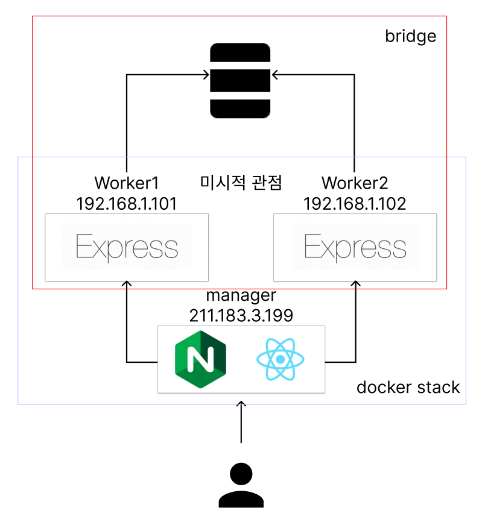

# REACT EXPRESS(NODE SERVER) NGINX DOCKERSTACK

[[개발회고\] Docker Swarm(Docker Stack) + React + Express(Node Server) + Nginx + Reverse Proxy (tistory.com)](https://tonyhan18.tistory.com/329)

위의 링크로 가면 만든 것을 확인할 수 있다.

# 사용기술
REACT
EXPRESS
NODEJS
DOCKER
DOCKER STACK
DOCKER SWARM

# 프로젝트 구조


# 실행방법

```bash
cd client
npm install
npm run build
docker build -f Dockerfile.dev -t tonyhan18/react:1.0 .

cd ../server
npm install
docker build -t tonyhan18/express:1.0 .
docker image push tonyhan18/express:1.0

cd ..
docker stack deploy -c docekr-compose.yml swarm
---
# 삭제시
docker stack rm swarm
```

